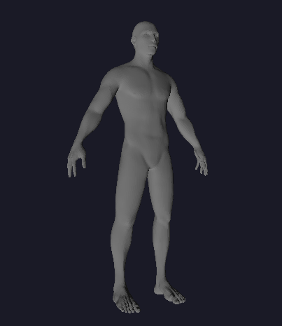
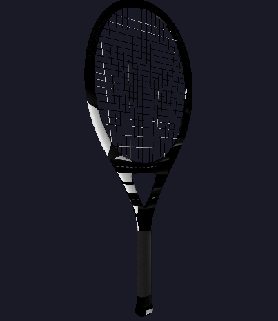
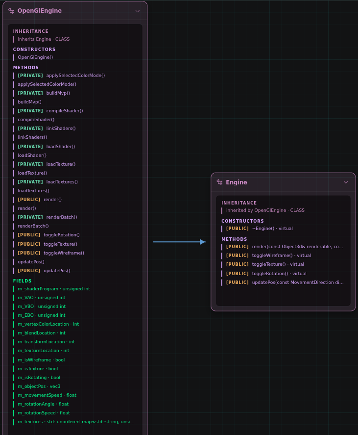

# scop

an OpenGL 3D object renderer written from scratch

## about
**scop** is a minimal 3D rendering program designed to load and display `.obj` files, written in c++

key components are:
- `.obj` file parser
- minimal math library in c
- an abstraction over glfw tailored for window management
- the rendering engine

the main resource for this project was this fantastic tutorial: https://learnopengl.com/Getting-started/OpenGL

### preview

<p align="center">
  
  
</p>

## usage and requirements
- the makefile downloads the neccessary library which is glfw
- detects linux/darwin and handles the platform-specific setup (kinda)
- requires OpenGL (duh)
- requires make (duh x2)
- requires g++ (mhm)

```bash
make
./scop <your_path_to_file>
```

you can find some examples in the /resources directory

## controls
- arrows -> movement in the X/Y axis
- W/S -> movement in the Z axis
- F -> toggle wireframe view
- T -> toggle texture view (if present)
- space -> start rotating

## architecture
the only graphics API utilized in this project is OpenGL.
However, the application was designed for smooth transitions to other APIs (eg. Vulkan)

*opengl engine design:*


## notes
created as a part of 42 Advanced Core in 42 Warsaw

all rights whatever ;)
